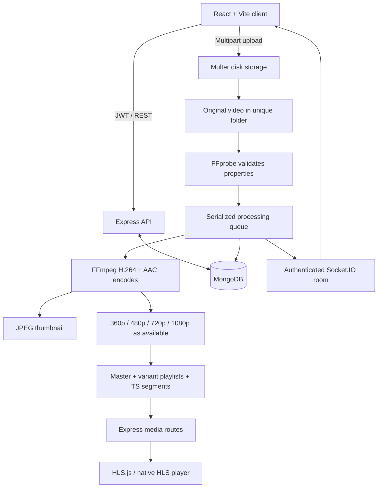

# My Video-Streaming-Platform Project

A full-stack MERN video platform with a simple dark interface and a real adaptive streaming pipeline. Upload a video, follow its processing progress, and watch it through an HLS master playlist with automatic or manual quality selection.

## Quick start

Requirements: Node.js 22.12+ (tested with Node 24), npm, and an internet connection for the first installation. FFmpeg and FFprobe binaries are installed with npm on supported platforms.

```sh
npm install
npm run dev:local
```

Open **http://127.0.0.1:5173**. This development command launches a real MongoDB process with WiredTiger storage in `.local-mongo/`, the Express API on port 5000, and Vite on port 5173. The MongoDB binary is downloaded automatically on first use. It is not a mock database. The development launcher creates a temporary JWT secret, so log in again after restarting it. Do not run two local launchers against the same data directory.

Create an account, choose **Upload video**, select an MP4/MOV/WebM/MKV/AVI/M4V file up to 500 MB, fill in the title and optional details, then upload. Once preparation finishes, choose **Watch video**. The initial library is intentionally empty: all cards, counters, and analytics come from uploaded videos and MongoDB.

## Standard MongoDB setup

For an installed MongoDB Community server or MongoDB Atlas:

1. Copy `server/.env.example` to `server/.env`.
2. Set `MONGO_URI` to your local database or Atlas connection string. For Atlas, create a database user and configure its network allowlist.
3. Generate a JWT secret using `node -e "console.log(require('crypto').randomBytes(48).toString('hex'))"` and set `JWT_SECRET`.
4. Run `npm run dev` from the repository root.

Alternatively, run the two processes separately:

```sh
cd server
npm run dev
# In another terminal, from the repository root:
cd client
npm run dev
```

Root installation uses npm workspaces and installs both applications. `npm run build` produces `client/dist`. `npm start` serves the API and compiled client. For this same-origin production build set `CLIENT_URL=http://127.0.0.1:5000` (or your public HTTPS origin behind a reverse proxy). The server binds to loopback by default.

| Variable | Default / purpose |
| --- | --- |
| `PORT` | `5000`, API port |
| `MONGO_URI` | `mongodb://127.0.0.1:27017/streamx` |
| `JWT_SECRET` | Required, at least 32 characters |
| `CLIENT_URL` | `http://127.0.0.1:5173`, exact permitted browser origin |
| `MAX_UPLOAD_MB` | `500`, server upload limit; update the client limit if changed |
| `FFMPEG_PATH` | Optional system binary override |
| `FFPROBE_PATH` | Optional system binary override |

Use `127.0.0.1` consistently in development; changing to `localhost` requires matching `CLIENT_URL`. Vite proxies `/api`, `/media`, and `/socket.io` to the API.

## Features

- Register, login, logout, bcrypt password hashing, signed JWTs, protected pages, editable profiles, user/admin authorization.
- Disk-backed multipart uploads with unique server-generated IDs, size/extension/MIME validation, and actual FFprobe validation during processing.
- Serialized FFmpeg jobs with persisted status, restart recovery, authenticated Socket.IO updates and polling fallback.
- Real 360p, 480p, 720p and 1080p HLS variants where the source allows; smaller sources keep their native even-numbered height.
- Automatic JPEG thumbnails, H.264/AAC segments, aligned keyframes and a multivariant master playlist.
- HLS.js automatic bitrate selection, manual quality, native HLS fallback, native playback controls, speed control and resume prompt.
- Browse/search/categories, related videos, idempotent likes, comments with owner/admin deletion, deduplicated views.
- Watch history, watch later, progress saved every 15 seconds and on pause/navigation/visibility changes.
- Creator channel, metadata editing, deletion of media and related records, creator overview and real analytics.
- Admin user/video/comment views and deletion with role enforcement on the server.
- Responsive dark UI, visible labels and focus states, loading skeletons, empty/error states and toast messages.

## Architecture



MongoDB stores users, videos and processing state, comments, saved videos, watch progress, and short-lived deduplication receipts. Media files live on disk, not inside MongoDB. Public media routes expose only generated thumbnails/playlists/segments of ready videos; originals are never publicly served.

### Adaptive streaming

FFprobe reads the source dimensions and duration. Each allowed height is encoded separately using H.264 video and optional AAC audio. Portrait rotation is accounted for when choosing dimensions. FFmpeg places keyframes at 4-second boundaries and writes VOD HLS playlists and `.ts` segments. A master playlist lists actual resolutions and bandwidths.

HLS.js loads the master playlist, estimates bandwidth and considers the playback buffer to choose future segments. Auto is the default (`-1`); selecting a quality sets `nextLevel` without reloading the source. Native HLS browsers use automatic selection when HLS.js is unavailable. The menu only lists levels parsed from the generated manifest. There is no MP4 playback fallback pretending to be adaptive streaming.

References: [FFmpeg HLS muxer documentation](https://ffmpeg.org/ffmpeg-formats.html#hls-2), [HLS.js API](https://hlsjs.video-dev.org/api-docs/hls.js.hls).

### Storage layout

```text
server/storage/<video-id>/
  original.mp4       # extension follows the uploaded container
  thumbnail.jpg
  master.m3u8
  360p/
    index.m3u8
    segment00000.ts
  480p/...
  720p/...
```

Jobs run one at a time to limit CPU and memory pressure. On startup, uploaded/processing records are requeued and regenerated. Failed jobs preserve their originals for diagnosis and can be deleted from My videos. Processing videos cannot be deleted until the job finishes, avoiding writes into removed directories. Metadata edits never trigger re-encoding.

## Source layout

```text
client/src/
  components/       # navigation, grid, states, player
  context/          # authentication and notifications
  pages/            # browsing, authentication, upload, watch, dashboard
  services/         # Axios client and shared helpers
  styles.css        # Tailwind import and responsive design system
server/
  app.js            # REST routes, validation, media serving, error handling
  index.js          # MongoDB startup and authenticated sockets
  config.js         # environment and categories
  models/           # Mongoose models and unique indexes
  middleware/       # authentication and authorization
  services/         # FFmpeg, probing, queue and recovery
  scripts/          # development MongoDB launcher and admin command
  tests/            # end-to-end API and real FFmpeg tests
```

## API overview

All JSON API routes use `/api`. Authentication uses `Authorization: Bearer <token>`.

| Group | Routes |
| --- | --- |
| Authentication | `POST /auth/register`, `POST /auth/login`, `GET /auth/me`, `PUT /auth/profile` |
| Discovery | `GET /videos?q=&category=&sort=&page=`, `GET /videos/search`, `GET /categories` |
| Video | `GET /videos/:id`, `POST /videos`, `PUT /videos/:id`, `DELETE /videos/:id` |
| Engagement | `POST /videos/:id/view`, `POST /videos/:id/like` with `{liked: boolean}` |
| Comments | `GET/POST /videos/:id/comments`, `DELETE /comments/:id` |
| Related | `GET /videos/:id/related` |
| Progress | `PUT /videos/:id/progress` with `{position: seconds}` |
| History | `GET /history`, `DELETE /history` |
| Saved | `GET /watch-later`, `POST/DELETE /watch-later/:id` |
| Creator | `GET /creator/videos`, `GET /creator/analytics`, `GET /channels/:id` |
| Admin | `GET /admin/users`, `GET /admin/videos`, `GET /admin/comments`, `DELETE /admin/videos/:id`, `DELETE /admin/comments/:id` |
| Health | `GET /health` |

History is recorded when playback starts or progress is saved. View receipts deduplicate each signed-in viewer, or a hash of guest IP/user-agent, within 30-minute clock buckets. This is a simple portfolio view count, not fraud-resistant analytics. Likes and watch-later additions are idempotent. Libraries/admin lists show the latest 100 records, comments the latest 100, and discovery uses 24-item pages.

To grant administrator access to a registered account using your configured MongoDB:

```sh
npm run admin -w server -- you@example.com
```

There is no public role assignment endpoint or default admin password. The temporary local launcher uses its own dynamically allocated MongoDB URI; use standard MongoDB configuration for the admin CLI, or pass that local URI via `MONGO_URI`.

## FFmpeg installation

The npm dependencies `ffmpeg-static` and `ffprobe-static` supply executables for supported operating systems. `GET /api/health` reports whether both run. If downloads are blocked or your architecture is unsupported, install system binaries and set the two override variables.

- **macOS:** `brew install ffmpeg`.
- **Ubuntu/Debian:** `sudo apt update` then `sudo apt install ffmpeg`.
- **Windows:** install an FFmpeg build linked by [ffmpeg.org/download.html](https://ffmpeg.org/download.html), extract it, add its `bin` directory to PATH, and set `FFMPEG_PATH` and `FFPROBE_PATH` to the `.exe` paths if needed.

Verify `ffmpeg -version` and `ffprobe -version`. Paths are passed to `spawn` without a shell. Uploaded filenames are never interpolated into shell commands.

## Verification

```sh
npm test
npm run build
npm run format:check
```

The integration suite starts an isolated real MongoDB database, generates an actual 720p video with audio using FFmpeg, registers and logs in users, uploads the video, waits for processing, and requests every quality playlist and a media segment. It verifies thumbnails, search, likes, comments, progress, history, watch later, analytics, admin restrictions, ownership enforcement and removal of disk files. An invalid MP4 must enter a failed state while the API remains available. Tests require permission to open local ports and download the MongoDB binary on first use.

To inspect adaptive behavior manually: upload a longer 720p+ video, play it on Auto, then use browser developer tools to throttle the network. Observe variant segment requests changing after the buffer and bandwidth estimate adjust. Choose manual qualities and verify the source does not restart. Native Safari HLS may expose only Auto in this app.

## Common issues

| Symptom | Resolution |
| --- | --- |
| Database connection fails | Start MongoDB/check `MONGO_URI`, or use `npm run dev:local`. |
| MongoDB binary download fails | Check network access to MongoDB downloads, or use an installed/Atlas database. |
| FFmpeg unavailable | Verify binary permissions and override paths; uploads return an explicit 503. |
| Video fails preparation | File may be corrupt, unsupported or lack a real video stream. See server logs and try another file. |
| API unavailable screen | Start the backend and check its port; the UI always renders an error/retry state. |
| CORS/socket connection blocked | Match `CLIENT_URL` to the exact browser origin, including hostname and port. |
| Upload too large | Default limit is 500 MB. Keep client/server limits and proxy body limits aligned. |
| Large video takes time | The queue processes one file and one quality at a time; this is CPU-bound. |
| Session expires after local restart | The development launcher rotates its secret. Log in again, or configure a persistent JWT secret. |
| Production page not found | Run `npm run build` before `npm start`. |

## Screenshots

The application is best explored with your own uploaded videos. Capture the home page, upload progress, watch page and creator dashboard after uploading; no stock videos or fabricated analytics are seeded into the main application.

## Scope and future improvements

This is a single-server portfolio application. Before an internet-scale deployment: move originals/segments to object storage and a CDN, use a durable multi-worker queue, add resource quotas and upload cleanup, refresh-token rotation/HttpOnly cookie sessions, password recovery, moderation, backups, monitoring, complete pagination, accessibility audits, and rate limits appropriate to a trusted reverse proxy. JWTs currently live in localStorage and expire after seven days; logout removes the client token and does not revoke already issued tokens server-side. Disk/database deletion is not a distributed transaction; a production service should use tombstones and retryable cleanup.

Subscriptions, live streaming, messaging and advanced recommendations are intentionally outside this project’s scope. The project prioritizes the real upload → processing → adaptive playback workflow.
